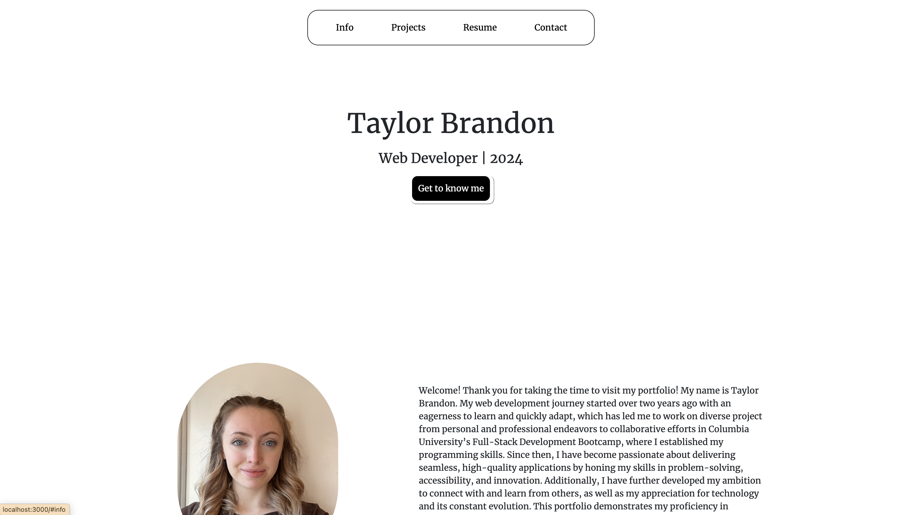
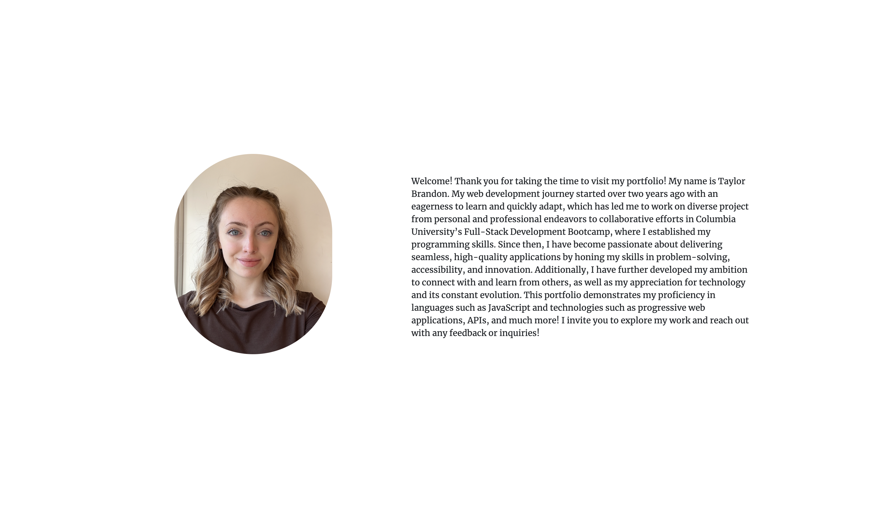
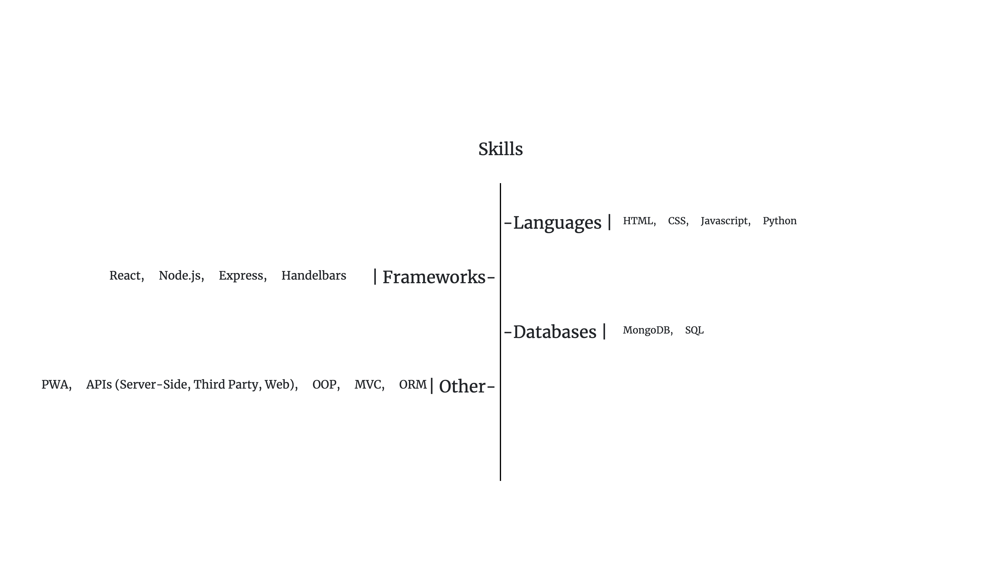
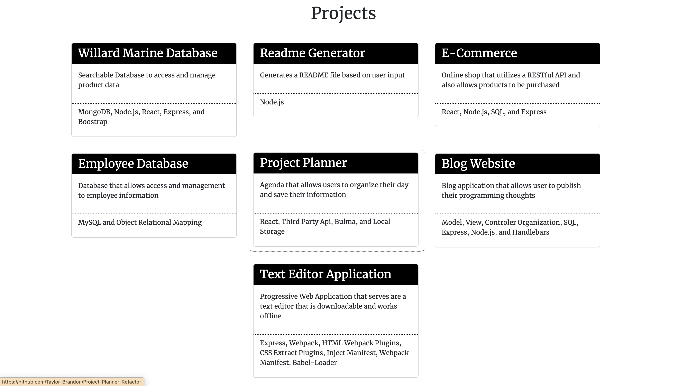
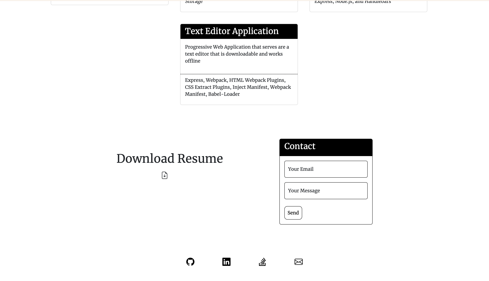

# React-Portfolio

## Table of Contents

* [Introduction](#introduction)
* [Features](#features)
* [Installation](#installation)
* [Technologies Used](#technologies-used)
* [Usage](#usage)
* [Screenshots](#screenshots)
* [Future Developments](#future-developments)
* [Contact](#contact)
* [Contributions](#contributions)
* [License](#license)
* [Demo](#demo)

## Introduction

This React portfolio application is designed to demonstrate a concise, scalable website that provides employers and fellow developers with contact information, a short personal introductory paragraph and photo, a downloadable resume, and a list of skills and projects to showcase proficiency.

## Features

* Sections for information, projects, resume, contact information.
* Responsive design for desktop, mobile, and table devices.
* Navigation that redirects user to the appropriate section when clicked on.
* Provides links to each project, allowing employers and developers to access its live demo or GitHub repository
* Contains a contact form that allows employers and developers to send their email and a message.
* Provides a downloadable resume for employers to access.
* Contains access to links to email, LinkedIn, Github, and Stack Overflow.
* Contains animations to ensure further interactivity.

## Technologies Used

* React Library
* Bootstrap Framework
* Bootstrap Icons
* CSS Styling
* CSS Animations
* Google Fonts

## Installation

This project can be accessed via the live demo link or locally by following these steps:

1. Clone the repository to your local machine.
2. Install the necessary dependencies by running npm install.
3. Start the application by running npm run start in your terminal.

## Usage

Navigate to the application

* Use the navigation bar to access the "Info," "Projects," "Resume," and "Contact" sections.
* Explore the Information section, which includes the developer's image, a descriptive paragraph, and an outlined list of skills.
* View project details in the Projects section by browsing cards that display titles, descriptions, and technologies used.
* Click on any project card to be redirected to its live demo or GitHub repository.
* Access the Resume section to download the developer’s resume by clicking the document icon.
* Complete the Contact Form to submit a message or email address for inquiries or feedback.
* Navigate to the developer’s GitHub, LinkedIn, Stack Overflow, or email via the footer links.

## Screenshots 

### Navigation

### Info Section

### Skills Section

### Projects Section

### Contact, Resume, and Footer Sections

## Future Developments

* Add a toggle button for light and dark mode to enhance accessibility.

* Highlight navbar links when viewing the corresponding section

## Contact

If there are any questions or feedback, feel free to reach out via: 

* Github Issues: [Github](http://Github.com/Taylor-Brandon)

* Email: [Email](mailto://taylorbrandon.dev@gmail.com)

## Contributions

Special thanks to Columbia Bootcamps for providing the educational resources necessary to complete this project.

## License

## Demo

Naviagte to Demo: [Here](https://taylor-brandon.github.io/React-Portfolio/)

    